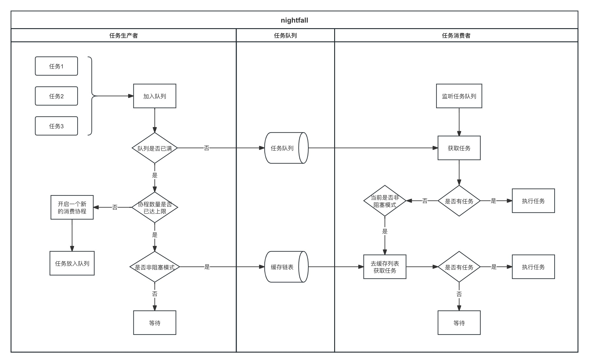

# worker

Go协程并发复用，降低CPU和内存负载

## 特点

1. 实现简单
2. 性能优异
3. 采用「生产-消费」模式
4. 任务支持context
5. 任务队列支持缓冲大小设置
6. 非阻塞模式下，任务缓存到全局链表
7. 配套设施：errgroup

## 流程图



## 效果

```shell
goos: darwin
goarch: amd64
cpu: Intel(R) Core(TM) i5-1038NG7 CPU @ 2.00GHz
```

### 场景-1

#### 👉 nightfall

```go
func main() {
    ctx := context.Background()

    pool := woker.NewPool(5000)
    for i := 0; i < 100000000; i++ {
        i := i
        pool.Go(ctx, func(ctx context.Context) {
            time.Sleep(time.Second)
            fmt.Println("Index:", i)
        })
    }

    <-ctx.Done()
}
```

##### cpu


##### mem


#### 👉 ants

```go
func main() {
    ctx := context.Background()

    pool, _ := ants.NewPool(5000)
    for i := 0; i < 100000000; i++ {
        i := i
        pool.Submit(func() {
            time.Sleep(time.Second)
            fmt.Println("Index:", i)
        })
    }

    <-ctx.Done()
}
```

##### cpu


##### mem


### 场景-2

#### 👉 nightfall

```go
func main() {
    ctx := context.Background()

    pool := woker.NewPool(5000)
    for i := 0; i < 100; i++ {
        i := i
        pool.Go(ctx, func(ctx context.Context) {
            for j := 0; j < 1000000; j++ {
                j := j
                pool.Go(ctx, func(ctx context.Context) {
                    time.Sleep(time.Second)
                    fmt.Println("Index:", i, "-", j)
                })
            }
        })
    }

    <-ctx.Done()
}
```

##### cpu


##### mem


#### 👉 ants

```go
func main() {
    ctx := context.Background()

    pool, _ := ants.NewPool(5000)
    for i := 0; i < 100; i++ {
        i := i
        pool.Submit(func() {
            for j := 0; j < 1000000; j++ {
                j := j
                pool.Submit(func() {
                    time.Sleep(time.Second)
                    fmt.Println("Index:", i, "-", j)
                })
            }
        })
    }

    <-ctx.Done()
}
```

##### cpu


##### mem


